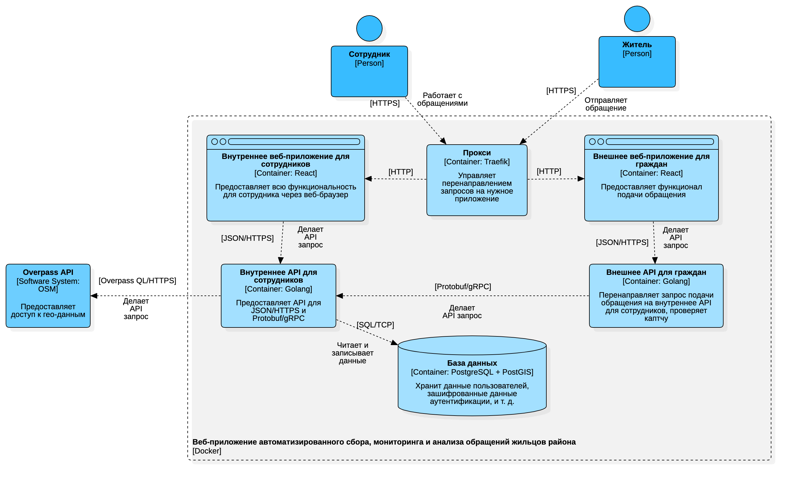
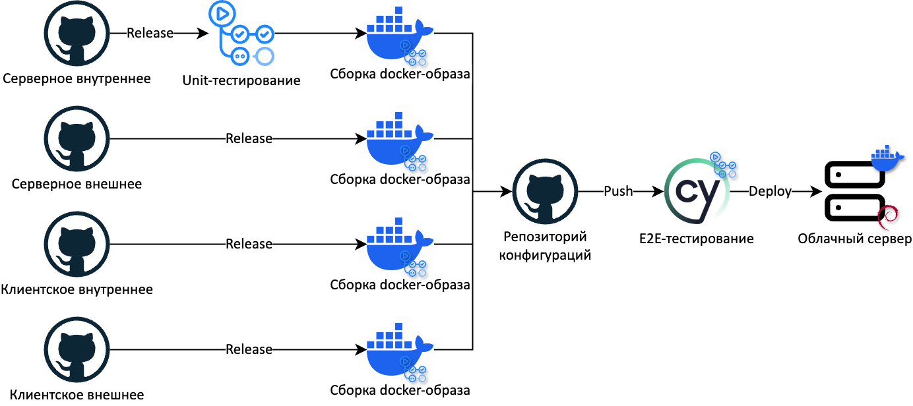
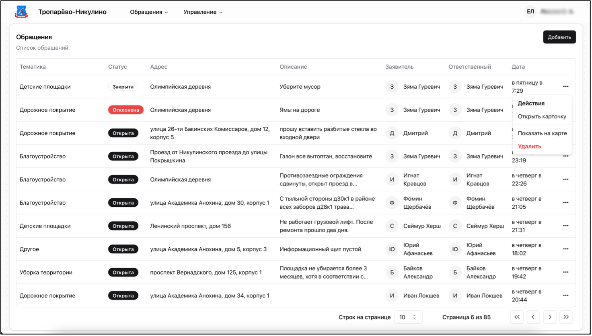
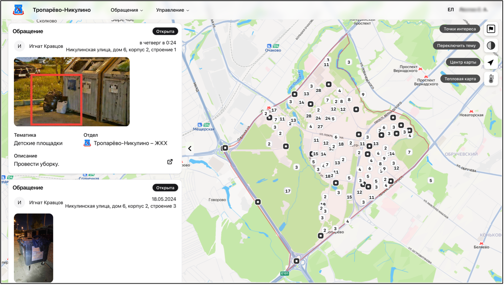
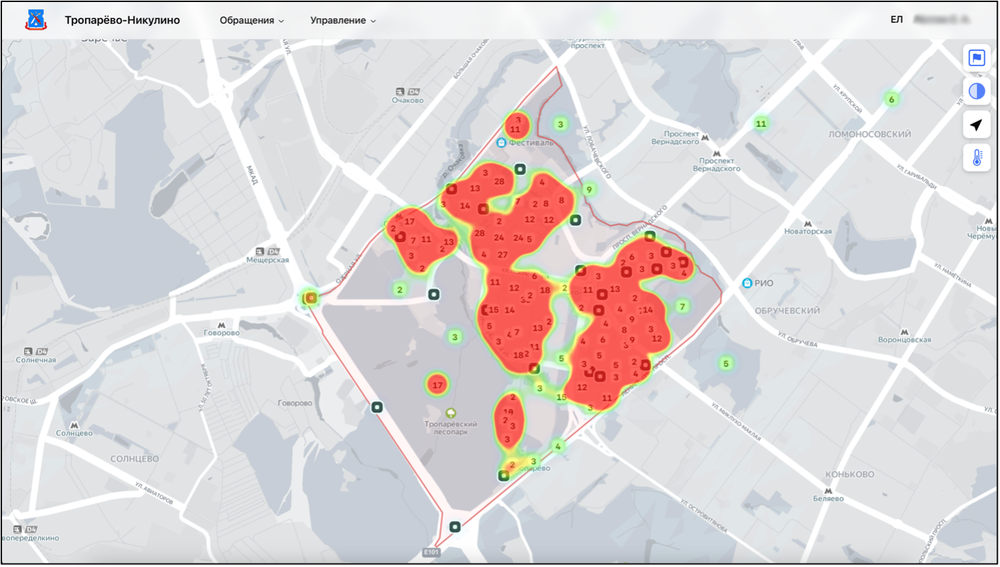
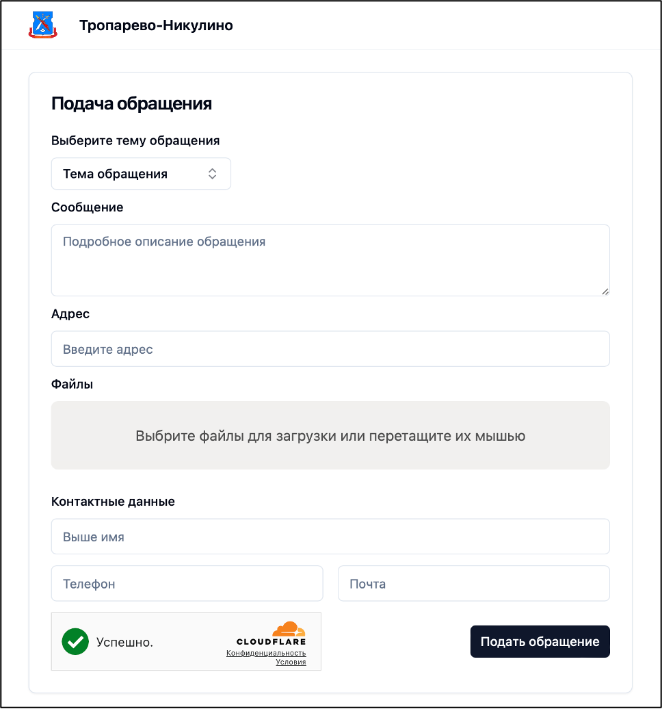

## Entrypoint of the residents-tracking-platform system
### A web application for automated collection, monitoring and analysis of complaints from residents of the district

## Setup
`cp .env.example .env`

## Build
`docker compose build`

## Run
`docker compose up -d`

### Structure
```
.
├── .github/ –> CI/CD configuration
├── docker/postgres/ -> pgsql extensions 
├── e2e/ –> End-To-End tests (cypress)
├── .env.example
├── .env.test
├── .gitignore
├── docker-compose.yml
└── README.md
```

### Architecture


### CI/CD pipeline


### Screenshots
#### internal application



#### public application
